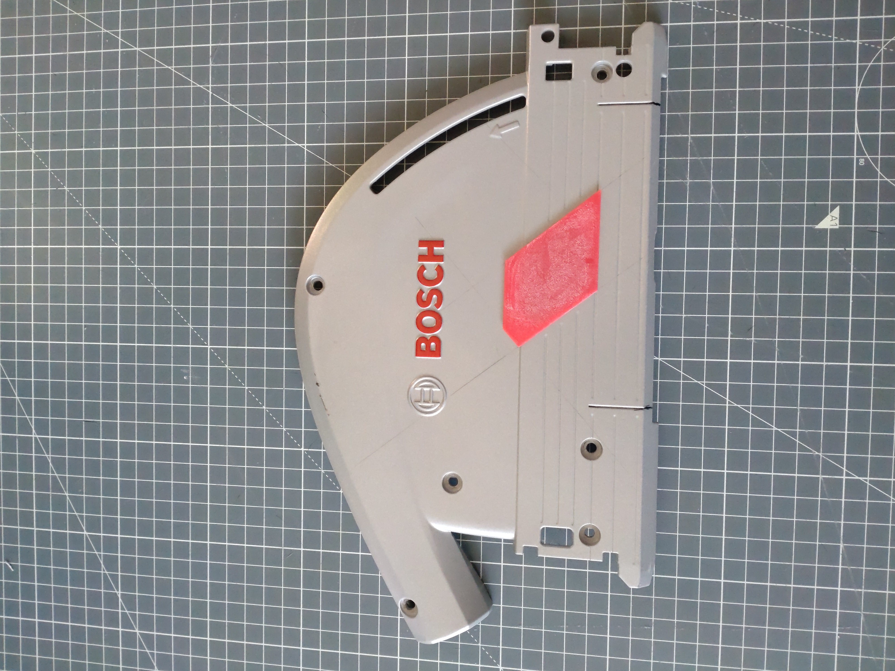
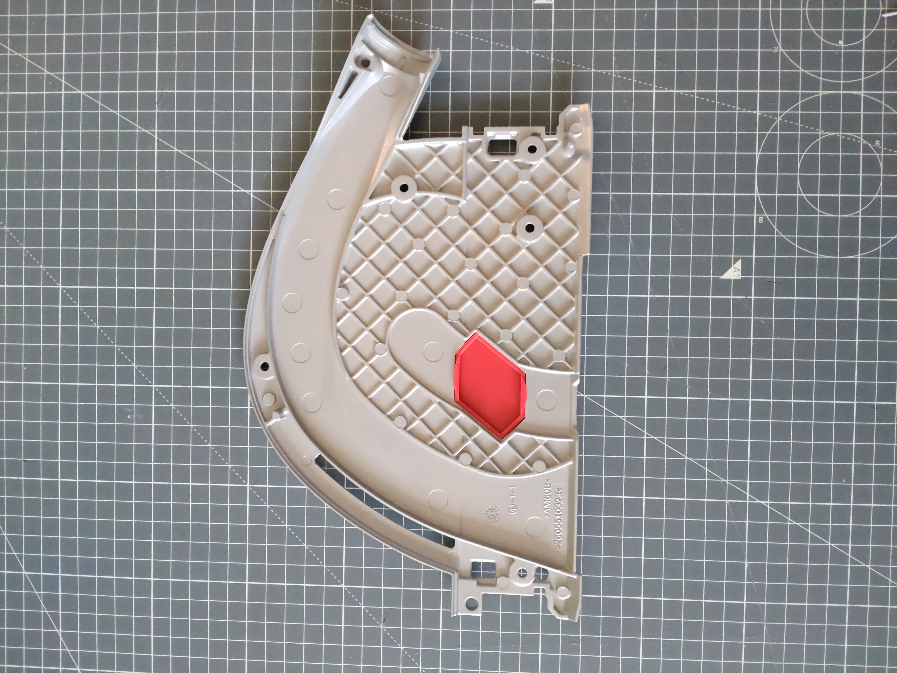
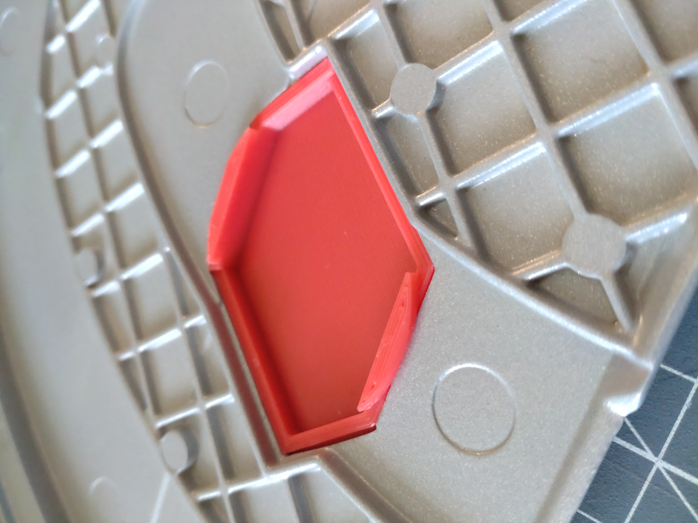
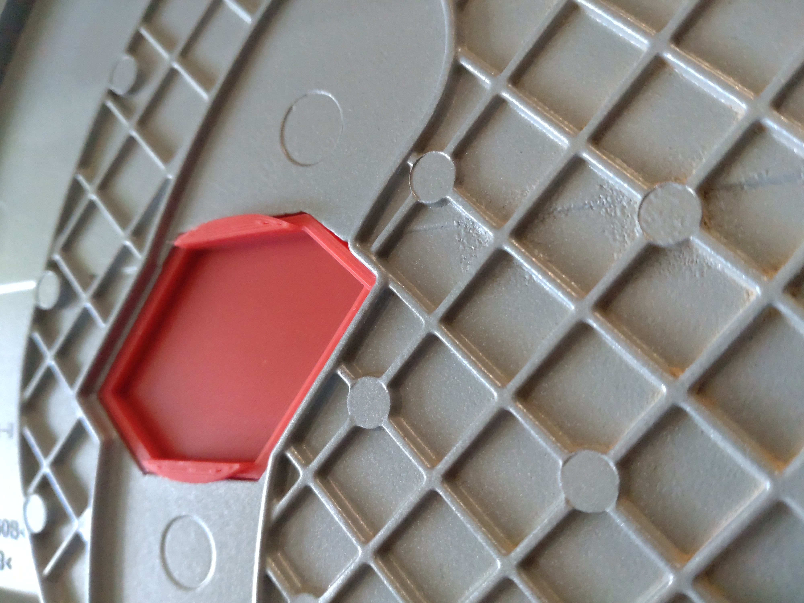
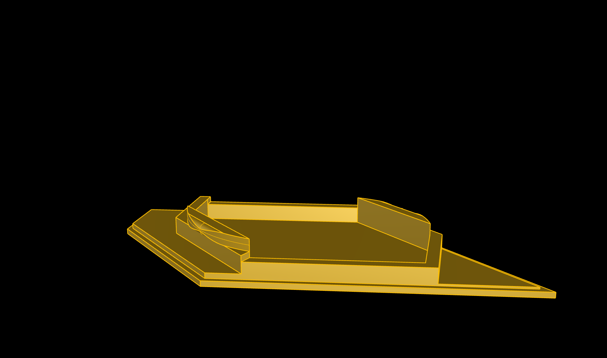
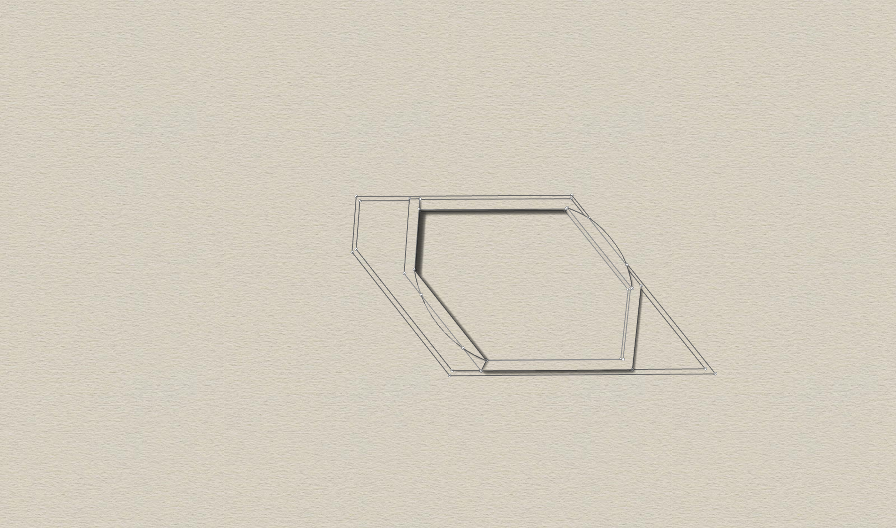

# Bosch-GKT-18V-52-GC-Dust-Cover
3D printable dust cover for Bosch GKT 52 GC plunge saw. Created with Rhino 8.

I recently bought this Bosch saw together with a Bosch GAS 18V L vaccum cleaner. 
To optimize to maximal air flow, i wanted a cover for the hole on the side. 
I found a stl file on printables but it didn't fit to the hole. It was not that accurated designed.
So here is my own one. It has two plastic clamps to prevent falling off from it's place.

I also created an click & clean adapter for the GKT plunge saw. Have a look in my repo.

Requirements:
* 3D printer 
* Filament of your choice (I use PETG)

## View

 

  

 
 

